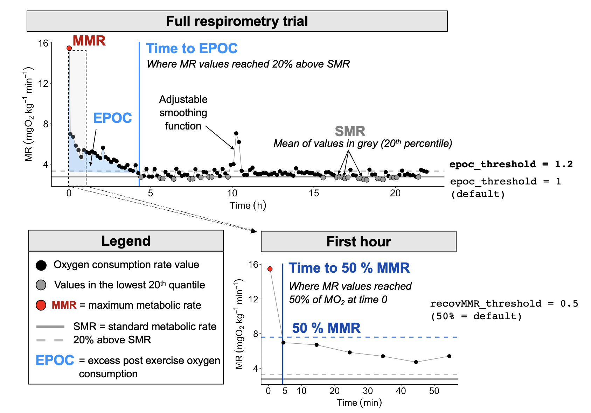
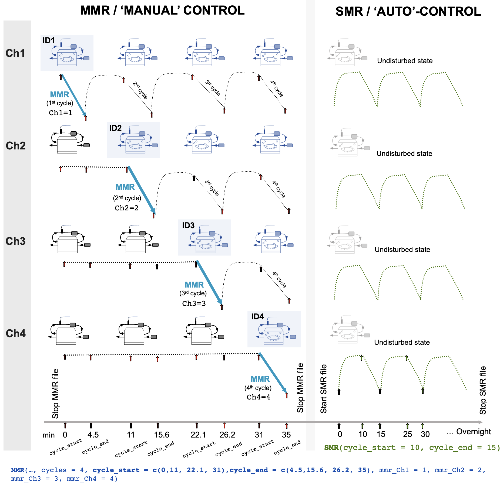
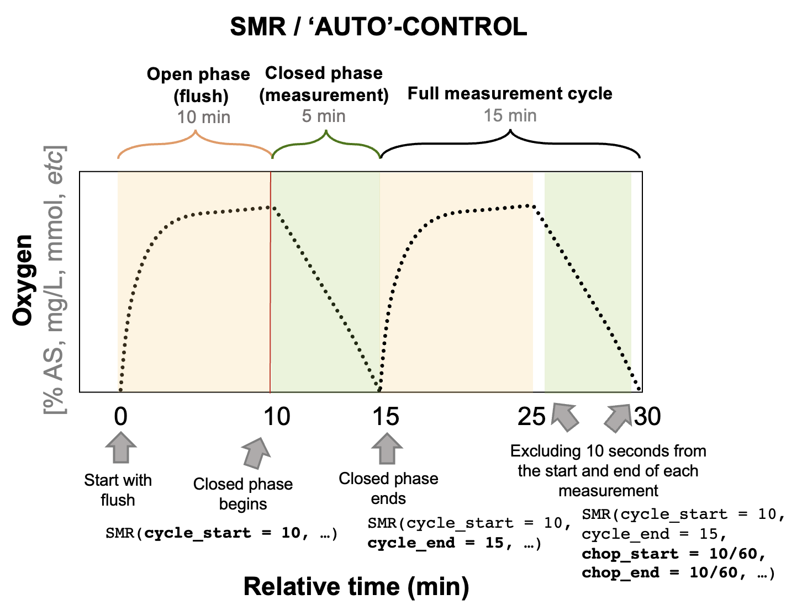

  <h2 style="font-size: 30px; text-align:left;">About Aquatic Respirometry</h2>
  
Source: <a href = "https://github.com/kraskura/AnalyzeResp_0/blob/main/docs/about.rmd" style = "color:gray;">AnalyzeResp_0/docs/about.rmd</a>

<h4 style="color:#325d88; font-weight: bold;  text-align: left"> Abbreviations / Vocabulary </h4>

- MR: Metabolic rate
- MO~2~: oxygen consumption rate (a proxy for metabolic rates)
- SMR: Standard Metabolic Rate, the minimim MR required to sustain life at the given set of conditions
- MMR: Maximum Metabolic Rate, the maximim (measured) MR that an animal can elicit
- EPOC: Excess Post-Exercise oxygen Consumption, or metabolic recovery (contains time and metabolic cost metrics)
- Time[MMR50]: the time it takes to recover MO~2~ to 50% of the measured MMR.
- SDA: Specific Dynamic Action, or metabolism associated with digestion (contains time and metabolic cost metrics)
- QC: quality control that includes checking and ensuring the quality of data, and if neccessary data cleaning to exclude technical or experimental anomolous recordings.

 

----------------------------------------------

<h4 style="color:#325d88; font-weight: bold;  text-align: left"> Full picture first </h4>

A time series of all automatic measurements to obtain SMR and/or RMR, and recovery if the first measurement is MMR. This repeat measurement period can differ in length, e.g. some species achieve resting metabolic state much sooner (within few hours) after being placed in the respirometer, in which case overnight measurements are not necessary.
In the figure below is an example O2 ~ time trend resulting from automatic metabolic rate measurements using intermittent flow respirometry. This may be used to enter the parameters in the SMR function correctly too, or to better relate to some data output files. Typically this measurement pattern is running overnight, producing several dozen of these cycles. The oxygen consumption rates a proxy of metabolic rates are recorded in animals that are undisturbed, not stressed, and is at post-absorptive state (common RMR and SMR assumption).

 

<h4 style="color:#325d88; font-weight: bold;  text-align: left"> Measuring maximum metabolic rates in 4 individuals </h4>

There are several experimental approaches to measure maximum metabolic rates. The method that we have used is conceptually depicted below. 

 

<h5 style="color:#325d88; font-weight: bold;  text-align: left"> Measuring standard (and routine/resting) metabolic rates using automatic repeat measurement cycles</h5>

Resting metabolic rate is an estimate measurement calculated from many recorded metabolic rate values in an individual. 

 

