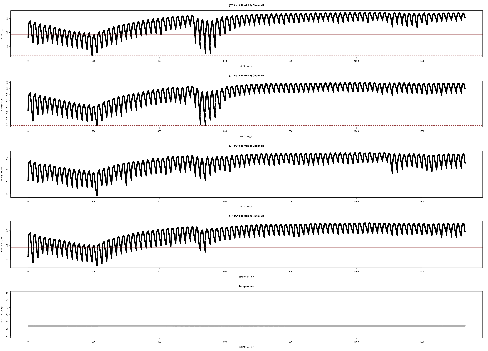
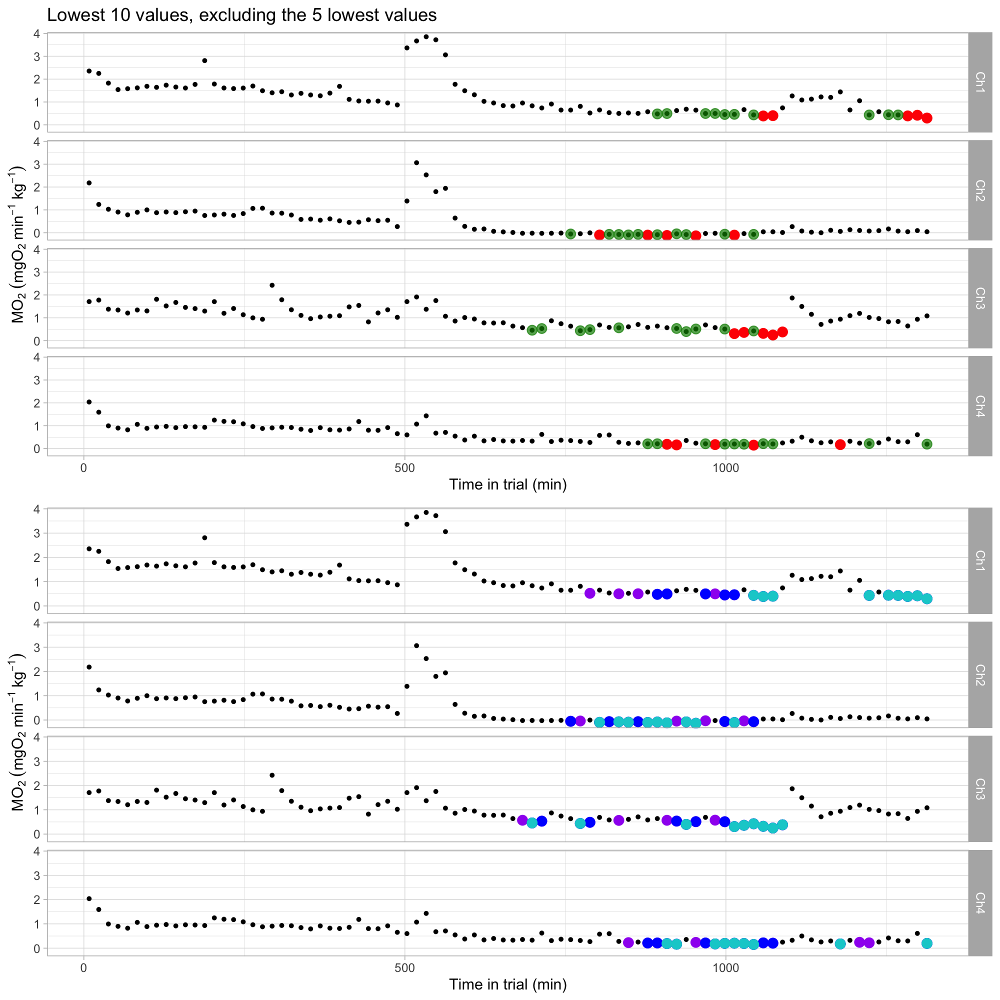

  <h2 style="font-size: 30px; text-align:left;">Step-by-step example to perform full analysis</h2>
  
Source: <a href = "https://github.com/kraskura/AnalyzeResp_0/blob/main/docs/demo_mmr_smr_as_epoc.rmd" style = "color:gray;">AnalyzeResp_0/docs/demo_mmr_smr_as_epoc.rmd</a>

  

<h4 style="color:#495057; font-weight: bold;  text-align: left">Navigate</h4>

<ul class="breadcrumb" style="background-color:#fff; border:none; color:#3e3f3a">
  <li><a href="#step1">Step 1 (setup)</a></li>
  <li><a href="#step2">Step 2 ()</a></li>
  <li><a href="#step3">Step 3</a></li>
  <li><a href="#step4">Step 4</a></li>K
  <li><a href="#step-add">Misc Steps</a></li>
</ul>

 
<h5 style = "font-weight: bold">
 <a name = "step1" style="color:black;
 font-weight: bold;
 border: 3px solid grey;
 border-radius: 5px;
 padding: 3px;"> STEP 1: &nbsp;</a> &nbsp; Set up, working directories, and formatting data files </h5>

First need to source the functions so they are available for use at the current R session, in the global environment:

<pre class = "sourceCode yaml"> 
source("./AnalyzeResp_0.R")
# any directory where the script with all used functions lives. Like a forked GitHub repo.

setwd() # set any working directory dedicated for metabolic performance analysis.
</pre>

**1. Set up a local working directory:**
 
There are many evaluation and analysis csv and image (.png) export files. These are automatically saved on the local directory. Each funciton has two general options for how these files are saved: i) all in one folder (local directory as specified by the user: "./"), ii) in local directories (data folders), all files are automatically placed buy functions (suggested for organisation).

To create the automatic organisation, run the following: 

<pre class = "sourceCode yaml"> 
organize_MR_analysis(create = "Full") # will create a full suite of folders and subfolders within in prep to analyze SMR, MMR, AAS
organize_MR_analysis(create = "SDA") # similar setup but selected folders for SDA analysis

</pre>
*documentation:* <a href="#./organize_MR_analysis.html" style = "color:#8e8c84; font-weight:bold;"><code>organize_MR_analysis</code></a>)
_Note! - sorry about the strange, not always intuitive names of folders. Please share any suggestions with preffered names of the files, directories and sub-directories_

 

**2. Converting and formatting files to .csv format**
In their original format, the files in .txt format (from Pyroscience, Firesting), but the data analysis functions require .csv files. Therefore, a part of the setup is the file conversion from text files to csv files. This can be done with one of the functions.
 
To convert raw firesting data files into compatable .csv file format **first** open the chosen working directory for this analysis and copy-in replicate .txt files to work with (always suggest working using copies of the original files). This part applied whether using a general repo, or directories created after running `organize_MR_analysis.html`. 

<pre class = "sourceCode yaml"> 

# for MMR files:
txt_csv_convert(txt_file = "./jul04_2019_opasize_box4_mmr.txt",  path = "MANUAL" , N_Ch = 4) # formated csv files is automatically save them in "MANUAL/csv_files" subfolders
txt_csv_convert(txt_file = "./jul04-2019-opasize-box4-mmr.txt",  path = "MANUAL" , N_Ch = 4) # formated csv files is automatically save them in "MANUAL/csv_files" subfolders

# for SMR overnight files:
txt_csv_convert(txt_file = "./jul04_2019_opasize_box4_smr.txt",  path = "AUTO" , N_Ch = 4) # formated csv files is automatically save them in "AUTO/csv_files" subfolders
txt_csv_convert(txt_file = "./jul04-2019-opasize-box4-smr.txt",  path = "AUTO" , N_Ch = 4) # formated csv files is automatically save them in "AUTO/csv_files" subfolders

# and example for files that were used to run bacterial respiration background: (here not considered)
txt_csv_convert(txt_file = "./jun01_2021_box1_back-allRespos.txt",  path = "BACTERIAL_RESP" , N_Ch = 4)

</pre> 
*documentation:* <a href="#./txt_csv_convert.html" style = "color:#8e8c84; font-weight:bold;"><code>txt_csv_convert</code></a>

**Outcome:** A new _.csv_ file will be created either locally (with `path = "."`) or in the _csv_files_ subfolder (`path = "AUTO"` or `path = "MANUAL"`), the original .txt file will remain in the current working directory. 

&nbsp;

<h5 style = "font-weight: bold"> <a name = "step2" style="color:black;
 font-weight: bold;
 border: 3px solid grey;
 border-radius: 5px;
 padding: 3px; "> STEP 2: &nbsp;</a> &nbsp; Analysis of MMR, finding the steepest slope  </h5>

The following script is to obtain oxygen decrease rates over time during a specific measurement cycle. This is originally written to analyze MMR of up to 4 individuals, each associated with a seperate channel in Firesting oxygen meter boxes. 

To use the 'MMR' function, first, the working directory needs to be set where the file is located. 
Then can execute the function with many parameters

<pre class = "sourceCode yaml"> 

# setting working directory 
setwd("./MANUAL/csv_files/")

# calling the MMR function
MMR(data.MMR = "./jul04_2019_opasize_box4_mmr.csv", # specify the .csv data file
    cycles = 2,  # this file will have two measurement (closed phase) cycles
    cycle_start = c(0, 11.02), # first cycle start at 0 min, and 2nd cycle starts at 11.2 min (retive time of the file)
    cycle_end = c(4.0, 15.95), # first cycle ends at 4 min, and 2nd cycle ends at 15.95 min (retive time of the file)
    mmr_Ch1 = 1, # an animal in channel 1 has the MMR measured in the first cycle. 
    mmr_Ch2 = 2, # an animal in channel 2 has the MMR measured in the second cycle. 
    mmr_Ch3 = 1, # an animal in channel 3 has the MMR measured in the first cycle. 
    mmr_Ch4 = 2, # an animal in channel 4 has the MMR measured in the second cycle. 
    clean_Ch1=c(0,0), # channel specific timeframes for the measurement 
    clean_Ch2=c(0,0), 
    clean_Ch3=c(0,0),
    clean_Ch4=c(0,0),
    path ="Folders", # this will automatically save output files in the dedicated output folders
    N_Ch = 4, # 4 channel firesting, 1 temperature probe
    date_format = "m/d/y", # the format of the date
    inv.data = NA) # no inventory data to perform more finedetail user-define measurement adjustments. 

</pre> 
*documentation:* <a href="./MMR.html" style = "color:#8e8c84; font-weight:bold;"><code>MMR</code></a>

- If the MMR file is shorter than 3 min, the sliding window analysis for MMR measurement is not performed. But, it always calculates the regression parameters for the full slope. The time frame to be used for the representative MMR estimates is later selected in `MMR_SMR_AS_EPOC` function.
- The `path` argument can be anything, it could be "HappyFishInFolders", "yayData", "myfolder"...

**Key outcome files:** 

on GitHub: <a href = "https://github.com/kraskura/AnalyzeResp_0/tree/main/Test/MANUAL/channel_plots" style = "color:gray;">AnalyzeResp_0/Test/MANUAL/channel_plots/</a>

 

Download Excel template from GitHub: <a href = "https://github.com/kraskura/AnalyzeResp_0/blob/main/Test/MANUAL_inventory_template.xlsx" style = "color:gray;">AnalyzeResp_0/Test/MANUAL_inventory_template.xlsx</a>

 

**MMR inventory data: How to?**

Excel file template

Column | Description 
---:| :----------- 
date | The date in 3-letter month + 2-number date (e.g. jun04, jan15, oct20, aug01... ). Important but inconvenient: excel tends to default to one of the data farmats. Counteract that by typing the apostrophe before text: 'jun04 
box	| The numeric of the Firseting box.
channel	| The number of the channel (1-4)
start	|  indicate the start time (minutes) of the measurement section to be KEPT, write 0 to discard this cycle.
end | indicate the end time of the section to be KEPT, write 0 to discard this cycle.

What to expect from each example row as indicated in the inventory file above?

- _rows 1_: The specific timeframes (start --> end) will be used to estimate metabolic rates. (see plotted example below)

*Tips and notes*:

- Be sure that the format of the inventory file is .csv, and that it is saved in the in the folder containing all data .csv files
- All inputs must be the same as the original csv file, that ensures that ine inventory file can be used for all data cleaning purposes
- To clean actual MMR cycle, use `MMR` argument `clean_Ch1, clean_Ch1, clean_Ch1, clean_Ch1` as needed.

&nbsp;

<h5 style = "font-weight: bold"> <a name = "step3" style="color:black;
 font-weight: bold;
 border: 3px solid grey;
 border-radius: 5px;
 padding: 3px;"> STEP 3 &nbsp;</a> &nbsp; Analysis of SMR slopes recorded on automatic cycles</h5>

There will likely be two seperate runs using `SMR` function. 

**1. First pass: A parametrized run without any QC** 
As before, be sure to set the correct working directory, if `organize_MR_analysis` was used for organization, the code below may be used.

The example below will be for calculating oxygen decrease rates for all measurement cycles; in this example case the cycles are specified to be 15 min long total, with 8:7 flush(open:measurement(closed) phase. None of the measurement cycles will be modified or otherwise cleaned (no inventory data). 

In some setups an additional wait period is used between the flush and measurement (flush:wait:measure). This code still may be used to analyze such files by either i) adding the wait time to the flush time that way it will be automatically excluded from the analysis, ii) adding the wait period to the measurement cycle time and use `chop_start` argument to exclude it from the analysis. In the example below, the first 10 seconds will be chopped off from each measurement cycle regression as a wait period.

When something seems to be out of order with the auto cycles, run the code with `flush_plot = TRUE`  and check whether the flush:measure cycle lengths are specified correctly. Otherwise, it may be better to keep `flush_plot = FALSE` because it takes a more time and computer memory.

<pre class = "sourceCode yaml"> 
setwd("../../AUTO/csv_files")

SMR(data="jul04_2019_opasize_box4_smr.csv",
    inventory_data=NA,
    cycle_start=8, # length of a full cycle, with open and closed phases together
    cycle_end=15, # this will take first 10 sec off as a wait period, can be decimal
    chop_start=10/60,
    chop_end=0,
    flush_plot="OFF",
    N_Ch=4,
    path="UseFolders",
    date_format = "m/d/y")
</pre>

</pre>
*documentation:* <a href="./SMR.html" style = "color:#8e8c84; font-weight:bold;"><code>SMR</code></a>

**Key outcome files:** 

1. Channel specific files 
This is just a snapshot of three measurement cycles for a specific channel. There are a total of 88 measurement cycles, all are plotted in one consolidated .png file.

on GitHub: <a href = "https://github.com/kraskura/AnalyzeResp_0/tree/main/Test/AUTO/plots_channel" style = "color:gray;">AnalyzeResp_0/tree/main/Test/AUTO/plots_channel</a>

 

2. All trends together 

on GitHub: <a href = "https://github.com/kraskura/AnalyzeResp_0/tree/main/Test/AUTO/plots_summary_respo" style = "color:gray;">AnalyzeResp_0/tree/main/Test/AUTO/plots_summary_respo</a>

 

**2. Second pass: applying QC as necessary** 

Everything remains the same if the cycles are correct, and the 10 sec wait time was confirmed appropriate; the only addition is the inventory data file (in .csv format). The inventory file must be in the csv_files folder. 

The downstream function incorporate cutoffs such as R^2^. We firmly believe that visual inspection of all oxygen decrease slopes is critical step of data analysis. 

Download Excel template from GitHub: <a href = "https://github.com/kraskura/AnalyzeResp_0/blob/main/Test/AUTO_inventory_template.xlsx" style = "color:gray;">AnalyzeResp_0/Test/AUTO_inventory_template.xlsx</a>

 

**SMR inventory data: How to?**

Excel file template: 

Column | Description 
---:| :----------- 
date | The date in 3-letter month + 2-number date (e.g. jun04, jan15, oct20, aug01... ). Important but inconvenient: excel tends to default to one of the data farmats. Counteract that by typing the apostrophe before text: 'jun04 
box	| The numeric of the Firseting box. s
channel	| The number of the channel (1-4)
cycle_file_start	|  To save time, add '0' if both the start and end are provided. Find the exact start time for the wanted cycle in '_analyzed.csv' file 'min_start' column, add that to **exclude the cycle**. 
sectioned_slope_start	|  indicate the start time (minutes) of the measurement section to be KEPT, write 0 to discard this cycle.
sectioned_slope_end	| indicate the end time of the section to be KEPT, write 0 to discard this cycle.
type | for general cleaning leave 'smr'. (part of development for greater user flexibility)

What to expect from each example row as indicated in the inventory file above?

- _rows 1-3_: The specific timeframes (sectioned_slope_start --> sectioned_slope_end) will be used to estimate metabolic rates. (see plotted example below)
- _row 4_: The measurement cycle starting at 23.16 min will be entirely excluded from the analysis. (see plotted example below)

*Tips and notes*:

- No cleaning necessary for measurement cycle with low R^2^. These measurement cycles will be automatically excluded using `MMR_SMR_AS_EPOC` (setting R^2^ thresholds)
- Be sure that the format of the inventory file is .csv, and that it is saved in the in the folder containing all data .csv files
- All inputs must be the same as the original csv file, that ensures that ine inventory file can be used for all data cleaning purposes

<pre class = "sourceCode yaml"> 

SMR(data="jul04_2019_opasize_box4_smr.csv",
    inventory_data= "smr_inventory_test.csv",
    cycle_start=8, # length of a full cycle, with open and closed phases together
    cycle_end=15, # this will take first 10 sec off as a wait period, can be decimal
    chop_start=10/60,
    chop_end=0,
    flush_plot="OFF",
    N_Ch=4,
    path="UseFolders",
    date_format = "m/d/y")

</pre>

**Key outcome files:** The same plots as before, but any specified section to be **used** for further analysis is indicated in grey shadowed box. The cycles that are excluded from the final dataframe are framed red with text box in the middle:

 

**3. Likely third run using SMR function: to estimate background respiration**
This exact same function can be run to analyze background respiration. If background was run on cycles that were not automatic, then best may be splitting the files up, or running the analysis using the `MMR` function.

<h5 style = "font-weight: bold"> <a name = "step4" style="color:black;
 font-weight: bold;
 border: 3px solid grey;
 border-radius: 5px;
 padding: 3px;"> STEP 4 &nbsp;</a> &nbsp; Estimating metabolic performances</h5>

*Before further analysis considerations*: The Need MMR_SMR_EPOC_AS function can be provided with one .csv file that represents SMR measurements and one .csv file that represents MMR measurements. Have more than one SMR file? - several SMR files can be combined and formatted using `combine_smr` function: see and example of this step under <a href="#step-misc">Misc Steps</a>

Once again, is starts with setting the working directory (example below)

In this example, both MMR and SMR files were recorded and have been analyzed using `MMR` and `SMR` functions, respectively. 

Some example customization for desired outcomes:

  - The regression R^2^ cut off is set 0.9 for MMR and 0.85 for SMR. All regression slopes that are below these thresholds will not be used. The MMR value will be calculated from the steepest 120-second slope, but if this length is not sufficient to keep the R^2^ at the chosen 0.9 level, it will automatically go to the next longer sliding window option (here would be 180 seconds). The goal is to keep R^2^ at the specified level, and have measurement period as specified or as close to it as possible, never shorter.
  - `epoc_threshold = 1.1`: The end time of recovery will be estimated as the time it takes for the animal to recover from its MMR level to 110% SMR. (= 1.1 X SMR). All other EPOC parameters will also be dependent on this value.
  - `recovMMR_threshold = 0.5`: It will find the time it takes for the animal to recover from its MMR level to 50% MMR (EPOC to 50% MMR and time to 50 % MMR will be calculated)
  - `drop_ch = 1`: channel 1 will be entirely excluded from the analysis
  - `scaling_exponent_smr = 0.89`, scaling for smr (all data.SMR) values will be corrected to common mass using 0.89 scaling exponent (deafult 1 kg, but can be specified using `common_mass` arg). 
  - `end_EPOC_Ch`: the manual selection of when the EPOC end for the animal, can be applied to specific channel. Useful when the smoothing functions are not performing all that well.

In this example, background respiration is assumed to be negligible and is not considered when calculating MO2 values (all background arguments are comment out)

<pre class = "sourceCode yaml"> 
setwd("/Users/kristakraskura/Github_repositories/Respirometry_Performances/Test/MMR_SMR_AS_EPOC/csv_input_files")

MMR_SMR_AS_EPOC(
      	data.MMR = "jul04_2019_opasize_box4_mmr_analyzed.csv",
      	data.SMR = "jul04_2019_opasize_box4_smr_analyzed.csv",
        AnimalID = c("FISH1","FISH2","FISH3","FISH4"),
        BW.animal = c(0.065,0.068,0.061,0.062),
      	resp.V = c(1.9,1.9,1.5,1.5),
      	r2_threshold_smr = 0.85,
      	r2_threshold_mmr = 0.9,
        scaling_exponent_mmr = 1,
      	scaling_exponent_smr = 0.89,
        epoc_threshold = 1.1,
      	drop_ch = 1,
      	recovMMR_threshold = 0.5,
      	plot_smr_quantile=10, 
      	mo2_val_for_calc = "mo2_1kg", # "mo2_1kg", mo2_common_mass_kg, mo2_per_individual_kg
        end_EPOC_Ch = c((4.5*60), NA, NA, (5*60)), # must match the N(channels), use NA otherwise, input in minutes
      	# mmr_type = "mean",
      	min_length_mmr = 120,
      	spars_levels = c(0.1, 0.3),
        background_prior = "jul04_2019_box4_back_pre_dummy_analyzed.csv" ,
        background_post = "jul04_2019_box4_back_post_dummy_analyzed.csv" ,
        background_slope = NULL,
        background.V = NULL,
        MLND=TRUE,
        match_background_Ch = TRUE,
        mmr_background = "SAME_slope",
        background_linear_gr = TRUE,
        path="foldering",
      	date_format = "m/d/y",
      	N_Ch = 4, 
      	common_mass= 1) # in kg

</pre>
*documentation:* <a href="./MMR_SMR_AS_EPOC.html" style = "color:#8e8c84; font-weight:bold;"><code>MMR_SMR_AS_EPOC</code></a>

Below is an example `MMR_SMR_AS_EPOC` function run using the minimum number of required parameters and that will still allow function to run nicely.
Although, **I suggest specifying a few arguments every single time** and ignore their default value, those include:
  * `path = "StayOrganizedWithPoorlyNamedFolders"`. If `organize_MR_analysis` was not used, then default is local directory. Two things regardings this option: i) the input files need to located in the set (current ".") working directory, and ii) a pile of exported files will be all saved in this directory, can feel disorganised while getting used to using this function.
  * `date_format = "m/d/y"` (the default) this is the most common date format in Firesting .txt files, but if that is not the case for the files on hand, it will hit back an error. Change accordingly

<pre class = "sourceCode yaml"> 

MMR_SMR_AS_EPOC( data.MMR = "jul04_2019_opasize_box4_mmr_analyzed.csv",
      data.SMR = "jul04_2019_opasize_box4_smr_analyzed.csv",
      AnimalID = c("23-rbred","27-ltred","27-lbred","27-rtred"),
      BW.animal = c(0.065,0.068,0.061,0.062),
      resp.V = c(1.890,1.890,1.4475,1.4475),
      r2_threshold_smr = 0.85,
      r2_threshold_mmr = 0.9,
      min_length_mmr = 120)

</pre>

 

**Key outcome plots**

1. Channel specific 

1.1. 
on GitHub: <a href = "https://github.com/kraskura/AnalyzeResp_0/tree/main/Test/MMR_SMR_AS_EPOC/plots_ch_EPOC" style = "color:gray;">AnalyzeResp_0/tree/main/Test/MMR_SMR_AS_EPOC/plots_ch_EPOC</a>

 

1.2. 
on GitHub: <a href = "https://github.com/kraskura/AnalyzeResp_0/tree/main/Test/MMR_SMR_AS_EPOC/plots_min_values_SMR" style = "color:gray;">AnalyzeResp_0/tree/main/Test/MMR_SMR_AS_EPOC/plots_min_values_SMR</a>

 

2. All channels together

on GitHub: <a href = "https://github.com/kraskura/AnalyzeResp_0/tree/main/Test/MMR_SMR_AS_EPOC/plots_methods_sum_SMR" style = "color:gray;">AnalyzeResp_0/tree/main/Test/MMR_SMR_AS_EPOC/plots_methods_sum_SMR</a>

 

<h5 style = "font-weight: bold"> <a name = "step-misc" style="color:black;
 font-weight: bold;
 border: 3px solid grey;
 border-radius: 5px;
 padding: 5px;
 "> STEP-misc: &nbsp;</a> &nbsp; Additional steps that may be needed </h5>

**1. Splitting files that contain a part of non-regular measurement cycles and part automatic measurement cycles.**
Example situation, when MMR and SMR/RMR cycling is all recorded in one continous file. 
One way to handle this would be to note the time when the _split_ needs to happen and then create two csv files, one for "AUTO" cyclical measurment analysis, and one for analysis of "MANUAL", manually chosen, measurement cycles (typically MMR). Note each file is assumed to start with relatve time 0 min. There is a function to handle these situations. 

*Notes:* First, be sure to set the working directory where the file is located. All outputs will be saved locally (no automatic folders here)

- Handy, when MMR/MANUAL and SMR/AUTO data are recorded in one continuous file.
- Handy, When the SMR/AUTO files does not start with a flush
- Use, _after_ <a href="#step1">step 1</a> when files are formatter to .csv for the analysis
- Tip: seperate all files to be split in entirely different directory and perform all analysis locally

Example:
<pre class = "sourceCode yaml"> 
# 4 channnel Firesting example
csv_file_split(data="Aug16_2017_Box1_fullfile.csv",
               split_data_name="TEST_split-4ch",
               cycle_full_min=10,
               timeSplit=58.5,
               split=TRUE,
               N_Ch=4,
               date_format="m/d/y")

# 8 ch Firesting example
csv_file_split(data="Sep24_2019_box0_fullfile.csv",
               split_data_name="TEST_split-8ch",
               cycle_full_min=10,
               timeSplit=42,
               split=TRUE,
               N_Ch=8,
               date_format="d/m/y") # notice the different time/date format
</pre>

**2. To combine smr files (if needed)**

To use MMR_SMR_AS_EPOC function, only one "auto" or "smr" file can be used. In case when there are multiple files, they need to be first combined. 

- Handy, when multiple files were started during the automatic measurement phase. Can be the same or different measurement:flushing cycle ratios. 
- Use, before <a href="#step4">step 4</a>

The combined file will get a with the tag "GLUED_nX" (x = n of files), which will be saved in two places: i) the local directory and ii) in the folder "MMR_SMR_AS_EPOC/input_files". 

<pre class = "sourceCode yaml"> 

setwd("/Users/kristakraskura/Desktop/BOX/UCSB/Research/Perch /data/Respiromtery data- preggo- acute/AUTO/csv_analyzed/")
combine_smr(smr_files=c("jun01_2021_box1_smr1_mgO2L_analyzed.csv",
                        "jun01_2021_box1_smr2_mgO2L_analyzed.csv",
                        "jun01_2021_box1_smr3_mgO2L_analyzed.csv"),
            date_format = "m/d/y")

</pre>

**3. Convert all csv files from AS to mgO2.L**

While working 
I am using a loop t

<pre class = "sourceCode yaml"> 
convert.o2.Firesting(csv.data = "FileToCovert.csv", n_ch = 4, sal = 35)

setwd("/Users/kristakraskura/Desktop/BOX/UCSB/Research/P erch /data/Respiromtery data- preggo- acute/MANUAL/csv_files/")
n.mmr.files<-length(list.files())
mmr.files<-list.files("/Users/kristakraskura/Desktop/BOX/UCSB/Research/Perch /data/Respiromtery data- preggo- acute/MANUAL/csv_files/")

for (i in 1:n.mmr.files){
  
  mr.file<-mmr.files[i]
  convert.o2.Firesting(csv.data = mr.file, n_ch = 4, sal = 35)
}

</pre> 
*documentation:*

# These will be saved in your current working directory with the 
# I am looping through all files to get this work. 
# For a single file example: 

