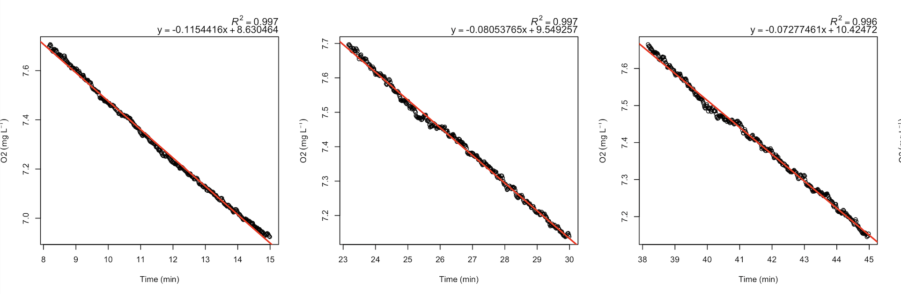

  <h2 style="font-size: 30px; text-align:left;">Step-by-step example of analysis in R</h2>
  
Example code<a href = https://github.com/kraskura/AnalyzeResp_0/blob/main/R/Test_AnalyzeResp_0_clean.R style = "color:gray;"> https://github.com/kraskura/AnalyzeResp_0/blob/main/R/Test_AnalyzeResp_0_clean.R</a>

  
Example materials<a href = " https://github.com/kraskura/AnalyzeResp_0/tree/main/Test" style = "color:gray;"> Directory on Github </a>

  

<h5 style="color:#495057; font-weight: bold;  text-align: left">Navigate</h5>

<ul class="breadcrumb" style="background-color:#fff; border:none; color:#3e3f3a">
  <li><a href="#step1">Step 1</a></li>
  <li><a href="#step2">Step 2</a></li>
  <li><a href="#step3">Step 3</a></li>
  <li><a href="#step4">Step 4</a></li>
  <li><a href="#step5">Step 5</a></li>
</ul>

 
<h5 style = "font-weight: bold">
 <a name = "step1" style="color:black;
 font-weight: bold;
 border: 3px solid grey;
 border-radius: 5px;
 padding: 3px;"> STEP 1: &nbsp;</a> &nbsp; Set up, working directories, and formatting data files </h5>

 
<pre class = "sourceCode yaml"> 
  source("./AnalyzeResp_0.R") # ./ directs to a currently active working directory. To ensure the code is available, try:
  list.files()
  setwd() # set any working directory dedicated to metabolic performance analysis.
</pre>
 

**1.1. (DONE ONCE) Download the script to any local directory.**

  [AnalyzeResp_0](https://github.com/kraskura/AnalyzeResp_0)

 

**1.2. Source the script containing all functions.**

  If not done, the functions will not be accessible during the current R session. 
  Alternatively: go to [Test_AnalyzeResp_0_clean.R](https://github.com/kraskura/AnalyzeResp_0/blob/main/R/Test_AnalyzeResp_0_clean.R)
  and copy-paste the function in the console and run the code.

 

**1.3. (DONE ONCE) Set up analysis working directory space:**
 
  Using these functions, produce and save locally many .csv and .png files.
  Currently, there are two options:
  + in the set working directory (folder on the user’s computer). (use `getwd()` to confirm the location). This is default in functions written as: `path = "./"`
  + in various folders automatically placed in(suggested for organization). This requires STEP 1 to run the next line of code:

<pre class = "sourceCode yaml"> 
  organize_MR_analysis(create = "Full") # will create a full suite of folders and subfolders within in prep to analyze SMR, MMR, AAS
</pre>

**Documentation:** <a href="#./organize_MR_analysis.html" style = "color:#8e8c84; font-weight:bold;"><code>organize_MR_analysis</code></a>

_Note! Do not rename the folders. Much agreed that the names of these folders are not intuitive in the current version. Suggestions with alternative names for the export files, directories, and sub-directories are always welcome_

**Outcome**

 

**1.4. (DONE ONCE) Transition from raw data .txt files to .csv files**

  <pre class = "sourceCode yaml"> 
  # for MMR files:
  txt_csv_convert(txt_file = "./jul04_2019_opasize_box4_mmr.txt",  path = "MANUAL" , N_Ch = 4) # formatted csv files is automatically save them in "MANUAL/csv_files" subfolders
  txt_csv_convert(txt_file = "./jul04-2019-opasize-box4-mmr.txt",  path = "MANUAL" , N_Ch = 4) # formatted csv files is automatically save them in "MANUAL/csv_files" subfolders
 
  # for SMR overnight files:
  txt_csv_convert(txt_file = "./jul04_2019_opasize_box4_smr.txt",  path = "AUTO" , N_Ch = 4) # formatted csv files is automatically save them in "AUTO/csv_files" subfolders
  txt_csv_convert(txt_file = "./jul04-2019-opasize-box4-smr.txt",  path = "AUTO" , N_Ch = 4) # formatted csv files is automatically save them in "AUTO/csv_files" subfolders
  
  # and example for files that were used to run bacterial respiration background: (here not considered)
  txt_csv_convert(txt_file = "./jun01_2021_box1_back-allRespos.txt",  path = "BACTERIAL_RESP" , N_Ch = 4)
</pre> 

The data files are in .txt format when using PyroScience software that interfaces with the FireSting oxygen meter. But, the analysis functions processes .csv files transformed to contain values only relevant for the analysis (e.g., O~2~, temperature, time).
  
  + The transformation from .txt to csv file can be done with `txt_csv_convert` function.
  + Suggestion: work with copies, not original data files. 
	
Quick steps:

  + Set working directory. If the `organize_MR_analysis` was used, then the setwd with .txt files should be the parent directory of “AUTO”, “MANUAL”, “MMR_SMR_AS_EPOC” folders. 
	+ Specify the `path` (see code example above)
  	+ AUTO = refers to SMR analysis for files that have been run on automatic timed flush:measure cycles. 
  	+ MANUAL = refers to MMR analysis for files that have been run adjusting times manually. 
  
  More info can be found [here](./about.html)

**Documentation:** <a href="#./txt_csv_convert.html" style = "color:#8e8c84; font-weight:bold;"><code>txt_csv_convert</code></a>

**Outcomes:** 
  
  + if using `path = "."`: a new _.csv_ file will be created and saved in the local directory (use `list.files()` to confirm)
  + if using `path = "AUTO"` or `path = "MANUAL"`: a new file will be created in 'csv_files' subfolder
  
  In both cases, the original non-modified .txt file remains in the current working directory. The .txt files can now be moved elsewhere; they are not used in any consecutive steps.
  

 
**1.5. OPTIONAL (DONE ONCE). Converting O~2~ measurement values**

 <pre class = "sourceCode yaml"> 
convert.o2.Firesting(csv.data = "FileToCovert.csv", n_ch = 4, sal = 35)

setwd(".../MANUAL/csv_files/") 
n.mmr.files<-length(list.files())
mmr.files<-list.files(".../MANUAL/csv_files/")

for (i in 1:n.mmr.files){
  
  mr.file<-mmr.files[i]
  convert.o2.Firesting(csv.data = mr.file, n_ch = 4, sal = 35)
}

</pre> 
 

 The `MMR_SMR_AS_EPOC` calculates metabolic rates in mgO~2~ L^-1 kg^-1. When the oxygen level unit in the raw data files is not mgO~2~ L^-1, it will require conversion. 

  + Common conversion: from air saturation % (AS%) to mgO~2~ L^-1
  + The function depends on rMR::DO.unit.convert and is a modified version of it. 
    * Similarly, also see similar modification: [FishResp::conver.rMR](https://www.rdocumentation.org/packages/FishResp/versions/1.1.0/topics/convert.rMR)
  + This must be done on each file
    * Suggesting writing a `for` loop for efficiency (see code example below)

**Documentation:** <a href="./convert.o2.Firesting.html" style = "color:#8e8c84; font-weight:bold;"><code>convert.o2.Firesting</code></a>

 
 

<h5 style = "font-weight: bold"> <a name = "step2" style="color:black;
 font-weight: bold;
 border: 3px solid grey;
 border-radius: 5px;
 padding: 3px; "> STEP 2: &nbsp;</a> &nbsp; Analysis of MMR: finding the steepest decline between O~2~ levels ~ time </h5>
 

<pre class = "sourceCode yaml"> 
# setting working directory 
setwd("./MANUAL/csv_files/")

# calling the MMR function
MMR(data.MMR = "./jul04_2019_opasize_box4_mmr.csv", # specify the .csv data file
    cycles = 2,  # this file has two measurement (closed phase) cycles
    cycle_start = c(0, 11.02), # first cycle start at 0 min, and 2nd cycle starts at 11.2 min (relative time of the file)
    cycle_end = c(4.0, 15.95), # first cycle ends at 4 min, and 2nd cycle ends at 15.95 min (relative time of the file)
    mmr_Ch1 = 1, # an animal in channel 1 has the MMR measured in the first cycle. 
    mmr_Ch2 = 2, # an animal in channel 2 has the MMR measured in the second cycle. 
    mmr_Ch3 = 1, # an animal in channel 3 has the MMR measured in the first cycle. 
    mmr_Ch4 = 2, # an animal in channel 4 has the MMR measured in the second cycle. 
    clean_Ch1=c(0,0), # channel specific timeframes for the MMR measurement 
    clean_Ch2=c(0,0), 
    clean_Ch3=c(0,0),
    clean_Ch4=c(0,0),
    path ="Folders", # this will automatically save output files in the dedicated output folders
    N_Ch = 4, # 4 channel firesting, 1 temperature probe
    date_format = "m/d/y", # the format of the date
    inv.data = NA) # no inventory data to perform more detailed user-defined measurement adjustments. 
</pre>

**2.1 Set the correct working directory**

To use the `MMR` function and access converted data .csv files, set the working directory to where the .csv files are located. 

**2.2. Parametrize and run `MMR`**

  See annotation directly by the example code.

  The following script is to obtain oxygen decrease rates over time during a user-specified measurement cycle. This code analyzes MMR in up to 4 individuals, each associated with one probe = channel in FireSting oxygen sensor (FireSting boxes). 

  If the MMR data file contains less than 3 min of data, the iterative "sliding window" analysis to find the steepest slope representing MMR measurement is not performed. Otherwise, it always calculates the regression parameters for the provided duration of the measurement.

**Documentation:** <a href="./MMR.html" style = "color:#8e8c84; font-weight:bold;"><code>MMR</code></a>

**Outcomes:** 

  
  
  
on GitHub: <a href = "https://github.com/kraskura/AnalyzeResp_0/tree/main/Test/MANUAL/channel_plots" style = "color:gray;">AnalyzeResp_0/Test/MANUAL/channel_plots/</a>

  
  + one figure produced per individual 
  + the first panel always has the full duration of the trend presented, and the shaded section shows the user-indicated MMR section 
  + the user-indicated MMR cycle plot, in this case, is the first measurement cycle. 
    * The plot is labeled MMR (second panel)
    * The colored slopes are the steepest i) 120 s (green), ii) 90 s (orange), iii) 60 s (purple); black regression is for a full duration
  + regressions parameters of all full slopes are noted above the plot
  + if any (not MMR) measurement cycle  is adjusted using 'inventory file,' it will be indicated in the legend box (see third panel, cycle 2)

   

 
 **2.3. OPTIONAL**

  **MMR inventory or channel-specific cleaning: What is it and how to use it?**

  

  
Download Excel template from GitHub: <a href = "https://github.com/kraskura/AnalyzeResp_0/blob/main/Test/MANUAL_inventory_template.xlsx" style = "color:gray;">AnalyzeResp_0/Test/MANUAL_inventory_template.xlsx</a>

  Column | Description 
  ---:| :----------- 
  **date** | Specify date **in the same format as it appears in the name of the original file**; here, 3-letter month + 2-number date (e.g., jun04, jan15, oct20, aug01). Important but inconvenient: excel tends to default to one of the data formats. Counteract that by typing the apostrophe before text: 'jun04 
  **box** | The numeric of the Firseting box.
  **channel** | The Number of the channel (1-4)
  **start** |  indicate the start time (minutes) of the measurement section to be KEPT; add 0 to discard this cycle.
  **end** | indicate the end time of the section to be KEPT; add 0 to discard this cycle.

  Description from the example image above:

  + _row 2_: **not-MMR** cycle 2 needs to be time-adjusted
    * Specifies that the filename where: **box4_jul04**, **box4-jul04** in any combination (not case sensitive, and not order specific). 
    * When `MMR` function is applied to this file, the timeframe of usable data for channel 3 will be adjusted to relative start at minute 10.9 and end at minute 13 (relative time in the data, assuming the file begins at time 0 min). This timeframe is not the corrected section for 2nd measurement cycle. 

  **Tips and notes**:

  - Be sure that the format of the inventory file is .csv and that it is saved in the folder containing all data .csv files
  - To clean actual MMR cycle, use `MMR` argument `clean_Ch1, clean_Ch1, clean_Ch1, clean_Ch1` as needed.

 
 

&nbsp;

<h5 style = "font-weight: bold"> <a name = "step3" style="color:black;
 font-weight: bold;
 border: 3px solid grey;
 border-radius: 5px;
 padding: 3px;"> STEP 3 &nbsp;</a> &nbsp; Analysis of SMR: analyzing each measurement cycle recorded on repeated cycles</h5>
 

  Two runs of `SMR` function for each data file may be necessary. 

  1. Parametrized run to get files for visual assessment of each measurement's quality. 
  2. Parametrized run to apply any time adjustments and cleaning, as decided after visual assessment of the data.

<pre class = "sourceCode yaml"> 
setwd("../../AUTO/csv_files")

SMR(data="jul04_2019_opasize_box4_smr.csv",
    inventory_data=NA,
    cycle_start=8, # length of the flush (min 0 - 8 relative time for each measurement cycle)
    cycle_end=15, # length of a full cycle, with open and closed phases together
    chop_start=10/60, # this will take the first 10 sec off as a waiting period. It can be decimal
    chop_end=0,
    flush_plot="OFF",
    N_Ch=4,
    path="UseFolders",
    date_format = "m/d/y")
</pre>

**3.1 Set the correct working directory**

  To use the `SMR` function and access correct converted data .csv files, set the working directory to where the .csv files are located. 

**3.2. First run: A parametrized run of `SMR` without any cleaning** 

  The rate of oxygen decrease (O~2~ levels ~ time; e.g., mgO~2~ min^-1) for all automatically isolated measurement cycles. 
    
  From the example code above:
    + The full respirometry cycle (flush:measure) length is 15 min long: `cycle_end=15`
    + 8-minute flush: `cycle_start=8`
    + None of the measurement cycles will be modified or otherwise cleaned (no inventory data): `inventory_data=NA`
    + The first 10 s from each measurement (closed) will be discarded as "wait period" for water mixing: `chop_start=10/60` (see notes below)

  An additional wait period can be used between the flush and measurement (flush:wait:measure) [Rosewarne et al 2016, See Fig 3](https://onlinelibrary.wiley.com/doi/10.1111/jfb.12795). In the provided example, the first 10 seconds would be equivalent to wait period and excluded from regression analysis.

  When something seems to be out of order with the auto cycles, run the code with `flush_plot = TRUE`  and check whether the flush:measure cycle lengths are specified correctly. Otherwise, it may be better to keep `flush_plot = FALSE` because it takes more time and computer memory.

**Documentation:** <a href="./SMR.html" style = "color:#8e8c84; font-weight:bold;"><code>SMR</code></a>

**Outcomes:** 

  
 
  
on GitHub: <a href = "https://github.com/kraskura/AnalyzeResp_0/tree/main/Test/AUTO/plots_channel" style = "color:gray;">AnalyzeResp_0/tree/main/Test/AUTO/plots_channel</a>

  
  + A snapshot of three measurement cycles for a specific channel. There are a total of 88 measurement cycles in a full example figure. 
    * One figure produce for each channel.
    * Red line: linear regression slope
    * Regressions parameters of all full slopes are noted above the plot
    * Time is in relative scale, assuming the file begins at time 0 

   
  
  
  
on GitHub: <a href = "https://github.com/kraskura/AnalyzeResp_0/tree/main/Test/AUTO/plots_summary_respo" style = "color:gray;">AnalyzeResp_0/tree/main/Test/AUTO/plots_summary_respo</a>

  + File showing the recorded data all on one timescale
    * panels top to bottom: Channel 1 O~2~ trend, channel 2 O~2~ trend, channel 3 O~2~ trend, channel 4 O~2~ trend, temperature trend (scale is set to 5- 35ºC)]
    * in panels 1-4:
      - solid red line: the mean O~2~ levels in the system during the trial
      - the dashed line: the lowest reached O~2~ levels in the system during the trial
   + if the Channel has no data, it shows as a straight line at zero

 

**3.3. OPTIONAL: Second run with data cleaning guidance** 

  **SMR inventory or channel-specific cleaning: What is it and how to use it?**

  <pre class = "sourceCode yaml"> 
  SMR(data="jul04_2019_opasize_box4_smr.csv",
      inventory_data= "smr_inventory_test.csv", # <<< Added after visual assessment of the data
      cycle_start=8, 
      cycle_end=15, 
      chop_start=10/60,
      chop_end=0,
      flush_plot="OFF",
      N_Ch=4,
      path="UseFolders",
      date_format = "m/d/y")

  </pre>

  No change running the `SMR` function unless there is a need to modify the wait-period, or cycle length. 
  The only addition is the inventory data file (in .csv format). **The inventory file must be in the csv_files folder.**

   
  

  
Excel template on GitHub: <a href = "https://github.com/kraskura/AnalyzeResp_0/blob/main/Test/AUTO_inventory_template.xlsx" style = "color:gray;">AnalyzeResp_0/Test/AUTO_inventory_template.xlsx</a>

  Column | Description 
  ---:| :----------- 
  **date** | The date in 3-letter month + 2-number date (e.g. jun04, jan15, oct20, aug01... ). Important but inconvenient: excel tends to default to one of the data formats. Counteract that by typing the apostrophe before text: 'jun04 
  **box** | The numeric of the Firseting box. s
  **channel** | The Number of the channel (1-4)
  cycle_file_start  |  To save time, add '0' if both the start and end are provided. Find the exact start time for the wanted cycle in '_analyzed.csv' file 'min_start' column, and add that to **exclude the cycle**. 
  **sectioned_slope_start** |  indicate the start time (minutes) of the measurement section to be KEPT, write 0 to discard this cycle.
  **sectioned_slope_end** | indicate the end time of the section to be KEPT, write 0 to discard this cycle.
  **type** | Not currently used. It can be used for user notes.

  Description from the example image above:

  + _rows 1-3: The specific timeframes (sectioned_slope_start --> sectioned_slope_end) will be used to estimate metabolic rates. (see plotted example below)
  + _row 4_: The measurement cycle starting at 23.16 min will be entirely excluded from the analysis. (see plotted example below)

  **Tips and notes**:

  + No cleaning necessary for measurement cycle with low R^2^. These measurement cycles will be automatically excluded using `MMR_SMR_AS_EPOC` and setting desired R^2^ thresholds ensuring automatized consistency 
  + Efficiency tip: writing and editing the inventory file in excel (.xlsx), transfer the necessary part to a new file in .csv
  + The format date must be the same as written in the name of the .csv file.
  + To exclude the cycle indicate start and end times for the slope as 0 0
  + Most errors during cleaning are due to typos

  **Outcomes**

  One figure for each channel is plotted again. This time with annotation adjustments according to the cleaning guidelines:
  
  + grey shaded sections indicates the sections approved **acceptable** for further analysis, representative of animal O~2~ uptake rate measurement.
  + red frame with a message: the measurements that are **excluded entirely** from the final data analysis
  + orange frame: the measurements, not cleaned but has low R~2~, only used to bring awareness of to the quality or scatter of the data

 

 
 
 

  **NEED TO SPLIT DATAFILES?**

  **Example scenarios:**

  + MMR/MANUAL and SMR/AUTO data are recorded in one continuous file.
  + SMR/AUTO files does not start with a flush
  + More than one SMR/AUTO file with various measurement times each (e.g., half a file contains automatic measurements of 10min:5min flush:measure, the other half is 9min:6min flush:measure); ! these should be combined again after `SMR` analysis. See STEP 5
  
  **Tips and notes:**
  
  + Identify the files that need to be split, move them into their own dedicated local directory (folder on the computer), and split the files there. ! be sure to confirm the split is at the correct place. 
  + Set the working directory where the file is located. Output files and newly split .csv files will be saved locally

  <pre class = "sourceCode yaml"> 
  
  # 4 channnel Firesting example
  csv_file_split(data="Aug16_2017_Box1_fullfile.csv",
                split_data_name="TEST_split-4ch",
                cycle_full_min=10, # relevant for plotting when split file is SMR 
                timeSplit=58.5, # in minutes
                split=TRUE,
                N_Ch=4,
                date_format="m/d/y")

  # 8 ch Firesting example (4 O~2~ probes, 4 temperature sensors)
  csv_file_split(data="Sep24_2019_box0_fullfile.csv",
                split_data_name="TEST_split-8ch",
                cycle_full_min=10,
                timeSplit=42,
                split=TRUE,
                N_Ch=8,
                date_format="d/m/y") # notice the different time/date format
  </pre>

  **Documentation** <a href="./csv_file_split.html" style = "color:#8e8c84; font-weight:bold;"><code>csv_file_split</code></a>

  **Outcomes**

    + Two .csv files
    + Each file starts at a relative time of 0 min (therefore, best in cases when MMR and SMR data are split)

 
 

&nbsp;

<h5 style = "font-weight: bold"> <a name = "step4" style="color:black;
 font-weight: bold;
 border: 3px solid grey;
 border-radius: 5px;
 padding: 3px;"> STEP 4 &nbsp;</a> &nbsp; Analysis of background respiration using SMR function</h5>
 

**4.1 Set the correct working directory**

  To use the `SMR` function and access correct converted data .csv files, set the working directory indicating **location of the background files** 

**4.2. Getting regression parameters for background respiration**

  Consider Options:

  1. If the background respiration was run on automatic repeat cycles (similar or same as the overnight resting metabolic rate measurements):
    
    + Use the `SMR` function, parametrize it accordingly. (See step 3)

  2. If the background was run on manually timed measurement cycles
    
    + 2 cycles, and the file starts with flush: can use the `SMR` function
    + 2 + cycles, and the file starts with a closed phase measurement: split the files and run `SMR` function (can technically analyze these regressions using the `MMR` function, but that is more computationally demanding)

 
 

&nbsp;

<h5 style = "font-weight: bold"> <a name = "step5" style="color:black;
 font-weight: bold;
 border: 3px solid grey;
 border-radius: 5px;
 padding: 3px;"> STEP 5 &nbsp;</a> &nbsp; Analysis of MMR, RMR, aerobic scopes and recovery</h5>
 

   

  **MORE THAN ONE ANALYSED SMR FILE REPRESENTING ON TRIAL?**  

  The `MMR_SMR_AS_EPOC` function accepts one .csv file with considered SMR regression parameters and one .csv file with MMR regression parameters. It is possible to have **more than one SMR file**. Several files with SMR measurements can be combined and properly formatted using `combine_smr` function.

  **Example scenarios:**

  + More than one SMR/AUTO file was created with various measurement times each (e.g., half a file contains automatic measurements of 10min:5min flush:measure, the other half is 9min:6min flush:measure)  
  + More than one SMR file for other experimental or technical reasons

    <pre class = "sourceCode yaml"> 

      setwd(".../AUTO/csv_analyzed/")
      combine_smr(smr_files=c("jun01_2021_box1_smr1_mgO2L_analyzed.csv",
                              "jun01_2021_box1_smr2_mgO2L_analyzed.csv",
                              "jun01_2021_box1_smr3_mgO2L_analyzed.csv"),
                  date_format = "m/d/y")

    </pre>

    **Outcomes**

  + The combined file with a name tag "GLUED_nX" (where x = n of files)
  + File is accessible: 
    * in the local directory (check `list.files()`
    * in the local folder "MMR_SMR_AS_EPOC/input_files", if the `organize_MR_analysis` was used in step 1 .

     

 
 

**5.1. Set working directory**

  This working directory needs to contain both:

  + data processed by `MMR` function: e.g., "jul04_2019_opasize_box4_mmr_analyzed.csv",
  + data processed by `SMR` function: e.g., "jul04_2019_opasize_box4_smr_analyzed.csv",

**5.2. Parametrize and run `MMR_SMR_AS_EPOC`**

  <pre class = "sourceCode yaml"> 
  setwd(".../MMR_SMR_AS_EPOC/csv_input_files")

  MMR_SMR_AS_EPOC(
    data.MMR = "jul04_2019_opasize_box4_mmr_analyzed.csv",
    data.SMR = "jul04_2019_opasize_box4_smr_analyzed.csv",
    AnimalID = c("FISH1","FISH2","FISH3","FISH4"),
    BW.animal = c(0.065,0.068,0.061,0.062),
    resp.V = c(1.9,1.9,1.5,1.5),
    r2_threshold_smr = 0.85,
    r2_threshold_mmr = 0.9,
    scaling_exponent_mmr = 1,
    scaling_exponent_smr = 0.89,
    epoc_threshold = 1.1,
    drop_ch = 1,
    recovMMR_threshold = 0.5,
    plot_smr_quantile=10, 
    mo2_val_for_calc = "mo2_1kg", # options: "mo2_1kg", mo2_common_mass_kg, mo2_per_individual_kg
    end_EPOC_Ch = c((4.5*60), NA, NA, (5*60)), # must match the N(channels), use NA otherwise, input in minutes
    # mmr_type = "mean",
    min_length_mmr = 120,
    spars_levels = c(0.1, 0.3),
    background_prior = "jul04_2019_box4_back_pre_dummy_analyzed.csv" ,
    background_post = "jul04_2019_box4_back_post_dummy_analyzed.csv" ,
    background_slope = NULL,
    background.V = NULL,
    MLND=TRUE,
    match_background_Ch = TRUE,
    mmr_background = "SAME_slope",
    background_linear_gr = TRUE,
    path="Folders",
    date_format = "m/d/y",
    N_Ch = 4, 
    common_mass= 1) # in kg

  </pre>

Examples and explanations for setting various parameter values from the code above:

  + R^2 thresholds; regression slopes that are below these thresholds are excluded.
    * The regression R^2^ cut off is 0.9 for MMR (`r2_threshold_mmr = 0.9`)
    * The regression R^2^ cut off is 0.85 for SMR (`r2_threshold_smr  = 0.85`).
  + Length of MMR measurement: The MMR value will be calculated from the steepest 120-second slope (`min_length_mmr = 120`).
    * If this length is not sufficient to keep the R^2^ at the chosen 0.9 level, it will automatically go to the next longer sliding window option (in this case, it would be 180 seconds).
    * The goal is to keep R^2^ at above the set threshold while providing the longest possible MMR measurement period
  + `epoc_threshold = 1.1`: the time of full recovery will be estimated as the time it takes for the animal to recover from its MMR level to 110% SMR. (= 1.1 X SMR).
  + `recovMMR_threshold = 0.5`: finds the time it takes and metabolic costs for the animal to recover from its MMR to 50% MMR (EPOC to 50% MMR and time to 50 % MMR)
  + `drop_ch = 1`: channel 1 will be entirely excluded from the analysis
  + `scaling_exponent_smr = 0.89`: scaling for SMR (all data.SMR) values will be corrected to common mass using 0.89 scaling exponent (default 1 kg, but can be specified using `common_mass` arg). 
  + `scaling_exponent_mmr = 1`: isometric scaling of MMR measurement
  + `end_EPOC_Ch = c((4.5*60), NA, NA, (5*60))`: manually assigned time (minutes) it took an animal to recover, assigned to each channel individually (Channel-1 = 4.5 hours, channel-4  = 5 hours, not specified for channel-2 and channel-3). 
  + `spars_levels = c(0.1, 0.3)`: the smoothing level for estimating recovery costs, the least smooth (0.1)  and mildly smooth (0.3) trends will be plotted. The “spar” is unitless, somewhat arbitrary in that sense. 
  + In this example, background respiration was measured before and after the trial, and these background files are provided (see step 4). 

 

**5.3. Minimally parametrized `MMR_SMR_AS_EPOC` run**

<pre class = "sourceCode yaml"> 
MMR_SMR_AS_EPOC( data.MMR = "jul04_2019_opasize_box4_mmr_analyzed.csv",
      data.SMR = "jul04_2019_opasize_box4_smr_analyzed.csv",
      AnimalID = c("23-rbred","27-ltred","27-lbred","27-rtred"),
      BW.animal = c(0.065,0.068,0.061,0.062),
      resp.V = c(1.890,1.890,1.4475,1.4475),
      r2_threshold_smr = 0.85,
      r2_threshold_mmr = 0.9,
      min_length_mmr = 120)

</pre>

**Suggestions:**

  + Specify `path` if previously used `organize_MR_analysis` function. Alternatively, the exports and imports compile in one folder. Check using `getwd()` and `list.files()`
  + Specify `date_format = "m/d/y"` (currently the default as this is the most common date format in Firesting .txt files, but if that is not the case for the files on hand, the function will error

 

**5.4. Other occasions:**

  + `MMR_SMR_AS_EPOC` can be run only to estimate SMR. Specify, `data.MMR = "none"`. See documentation
  + `MMR_SMR_AS_EPOC` can be run only to estimate MMR. Specify, `data.SMR = "none"`. See documentation

**Documentation:** <a href="./MMR_SMR_AS_EPOC.html" style = "color:#8e8c84; font-weight:bold;"><code>MMR_SMR_AS_EPOC</code></a>

**Outcomes:**

on GitHub: <a href = "https://github.com/kraskura/AnalyzeResp_0/tree/main/Test/MMR_SMR_AS_EPOC/plots_ch_EPOC" style = "color:gray;">AnalyzeResp_0/tree/main/Test/MMR_SMR_AS_EPOC/plots_ch_EPOC</a>

Metabolic rates across the duration of the experiment are particularly relevant when estimating recovery performance (EPOC and its relevant metrics).
  
  + Figure identifier: "EPOC_PLOT.png"
  + The Number of panels determined by values provided in the `spar_level` argument
  + The first measurement in this trend is MMR
  + The blue line connects dots according to the selected smoothness level (`spar_level`)
  + The colored horizontal lines show the SMR estimates using 5 different methods
  + The vertical lines
    * Dashed pink: Time to 50% MMR
    * Dashed grey: hourly marks (1, 2, 3, 4, 5 h into a trial)
    * Colored lines (overlapping in the image): estimate time to EPOC according to different types of SMR

 

on GitHub: <a href = "https://github.com/kraskura/AnalyzeResp_0/tree/main/Test/MMR_SMR_AS_EPOC/plots_min_values_SMR" style = "color:gray;">AnalyzeResp_0/tree/main/Test/MMR_SMR_AS_EPOC/plots_min_values_SMR</a>

Metabolic rates across the duration of the experiment. This figure highlights the MO~2~ measurements used to estimate SMR/RMR, and find resting level metabolic rates. 
  
  + Figure identifier: "_SMR_PLOT_SMR_analyses"
  + Plotted are two facet plots 
    * One facet for each channel
    * Discarded channels are not plot plotted
    * The channel ID is in the grey bar on the right side
  + Top panel facet plot:
    * Red symbols: 5 lowest values reported
    * Green symbols: after excluding the lowest 5 MO~2~ values (in red) the lowest 10 MO~2~ values (i.e., the lowest 6-15 values)
  + Bottom panel facet plot:
    * Turquoise: the lowest 10th percentile MO~2~ values
    * Turquoise + Blue: the lowest 15th percentile MO~2~ values
    * Purple + Turquoise + Blue: the lowest 20th percentile MO~2~ values
    
 

on GitHub: <a href = "https://github.com/kraskura/AnalyzeResp_0/tree/main/Test/MMR_SMR_AS_EPOC/plots_methods_sum_SMR" style = "color:gray;">AnalyzeResp_0/tree/main/Test/MMR_SMR_AS_EPOC/plots_methods_sum_SMR</a>

The comparison of estimated SMR/ RMR values using different methods: 
 
  + Figure identifier: "SMR_PLOT_SMR_methodsALL.png"
  + Channels are plotted in different colors
  + Number in the bubble is the Number of MO~2~ values used for calculations
  + SMR_low(n^th)quantile: the SMR value estimated as the mean of the lowest recorded values below nth quantile (10, 15, 20th quantile) (plot above, bottom panel, mean of colored values)
  + SMR_mean10minValues: the mean of 10 min lowest MO~2~ values, after excluding the lowest 5. (Figure above, top panel, green symbols)
  + SMR_mlnd: the SMR estimated following methods in Chabot et al 2016, the mean of lowest normal distribution 
  + For More information, see [Chabot et al 2016](doi:10.1111/jfb.12845), where each method to estimate SMR is described in detail.

 
 

----------------------------------------------------------------------------------------

*There are many more exports from each function, but all described on this page. Please refer to the function documentation*

