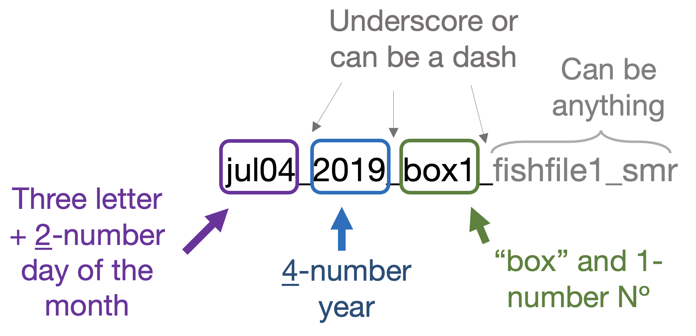

  <h2 style="font-size: 30px; text-align:left;">Demos</h2>

<ul>
  <li><a href="./demo_mmr_smr_as_epoc.html" style = "color:#29abe0; font-weight:bold;">Full analysis example for MMR, SMR, Absolute AS, and EPOC or recovery</a>
  <li><a href="./demo_sda.html" style = "color:#29abe0; font-weight:bold;">Analysis for SDA (prelim)</a>
  <li><a href="https://github.com/kraskura/AnalyzeResp_0/blob/main/R/Test_AnalyzeResp_0_clean.R" style = "color:grey;">Example Test R script: AnalyzeResp_0/R/Test_AnalyzeResp_0_clean.R</a>
</ul>
____________________________________________________________________________________________________________________________
 

 Before exploring the demos, please note this ineficiency: </h5>
There are steps in the analysis that depend on unique identifyers for each input files. Because of that the name of the file matters in order for the function to recognise it and process it. Be cautious of this starting the analysis. 
The "box#" must be a part of the name of this folder, but it can be anywhere in the file after the initial "date_year" part of the name.

 